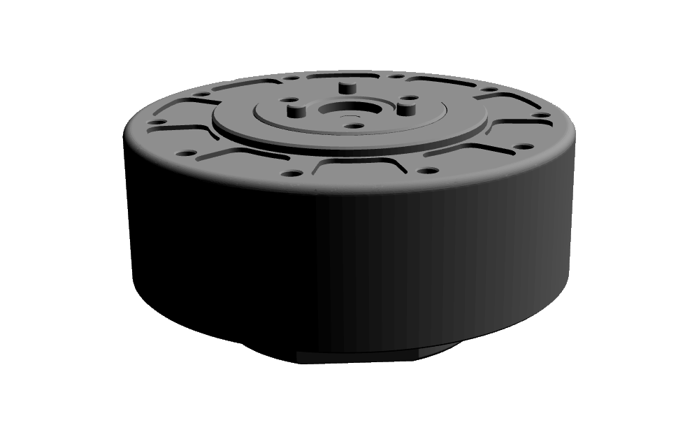

# MyActuator RH-series ROS 2

> [!NOTE]  
> This repository is a fork of [Tobit Flatscher's myactuator_rh_ros repository](https://github.com/2b-t/myactuator_rh_ros) and is currently being refactored and updated to support the newer RH-series actuators. Please note that this repository is still a work in progress and may not yet be fully functional.

Author: [Andrew Albright](https://github.com/asalbright) (2025)
Inspired by: [Tobit Flatscher](https://github.com/2b-t) (2024)

[](https://github.com/asalbright/myactuator_rh_ros/actions/workflows/build.yml) [](https://opensource.org/licenses/MIT)

## Overview

This repository holds the **URDF models** and [**`ros2_control` integration**](https://control.ros.org/humble/index.html) for the [**MyActuator RH actuator series**](https://www.myactuator.com/rh-harmonicmotor). The CAD models for the URDF models were obtained from the [offical MyActuator RH web page](https://www.myactuator.com/downloads-rhseries). The hardware interface is based on the [C++ driver that I have written for these actuators](https://github.com/asalbright/myactuator_rh).

You will need to clone both of the repositories to your ROS 2 workspace (e.g. `~/colcon_ws/src`):

```bash
git clone https://github.com/asalbright/myactuator_rh.git
git clone https://github.com/asalbright/myactuator_rh_ros.git
```

The first contains the C++ library as well as the Python bindings, the second the `ros2_control` integration and CAD models. Install the package dependencies with `$ rosdep install --from-paths src/ --ignore-src -r -y` (potentially you also have to [follow these instructions for installing the C++ library's dependencies](https://github.com/asalbright/myactuator_rh/blob/main/README.md)) and proceed to build your workspace with `$ colcon build --symlink-install`.

For more information regarding the individual packages inside this repository please refer to their corresponding individual read-mes.


